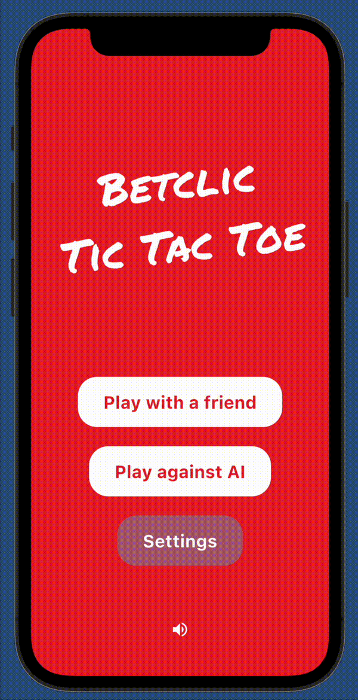

# BetclicTacToe

This is the technical test project for Betclic.

The target platforms are iOS and Android.



## Development

To run the app, prepare your simulator or physical device, then run:

```bash
flutter run
```

### Code organization

Code is organized into layer-based directories under `lib/`.

```text
  lib
  ├── app            # App-level code (main, setup, routing, translations)
  ├── data           # Data layer (repositories implementations, data sources)
  ├── domain         # Business logic (models, repositories interfaces)
  ├── presentation   # UI layer (widgets, screens)
  └── utils          # Utility classes and functions

```

### Building for production

To build the app for iOS (and open Xcode when finished):

```bash
flutter build ipa && open build/ios/archive/Runner.xcarchive
```

To build the app for Android (and open the folder with the bundle when finished):

```bash
flutter build appbundle && open build/app/outputs/bundle/release
```

### Audio

Audio is enabled by default and ready to go. You can modify code
in `lib/utils/audio/` to your liking.

The music tracks and sound effects are in `assets/sfx` `assets/music`.
These are royalty-free, properly licensed, and are included in this repository with permission.

### Logging

The template uses the [`logging`](https://pub.dev/packages/logging) package
to log messages to the console.

### Settings

The settings page is enabled by default, and accessible from the home screen.
Only the name of the player is saved to local storage using the
[`shared_preferences`](https://pub.dev/packages/shared_preferences)
package.

## Icon

To update the launcher icon, first change the files
`assets/icon-adaptive-foreground.png` and `assets/icon.png`.
Then, run the following:

```bash
dart run flutter_launcher_icons:main
```

You can [configure](https://github.com/fluttercommunity/flutter_launcher_icons#book-guide)
the look of the icon in the `flutter_icons:` section of `pubspec.yaml`.
To do this, you need to uncomment the lines under `flutter_launcher_icons:`.
